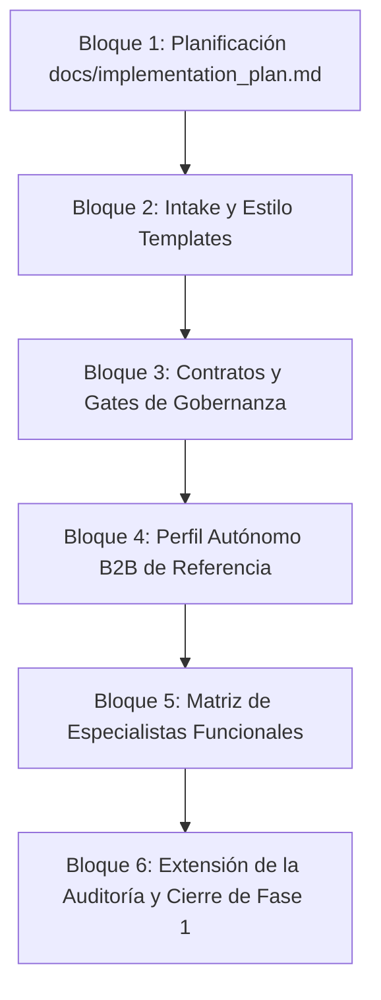

# Plan de Implementación — LinkedIn Content Framework

## 1. Propósito del Plan

Este documento organiza el desarrollo del framework de contenido para LinkedIn por fases, metas, entregables, criterios de cierre y riesgos. El plan prioriza la definición de la **capa editorial-operativa, el intake del perfil o proyecto, los esquemas de validación adaptativa (gates), la trazabilidad documental y los criterios de aceptación** antes de saltar directamente al diseño de agentes de IA, skills de código o flujos automatizados de publicación.

El framework opera bajo la premisa de que una automatización sólida solo es posible si existe un proceso manual bien definido, estable y auditable.

---

## 2. Principios de Implementación

El desarrollo del framework se rige por los siguientes principios metodológicos:

*   **Hibridación del Control:** La Inteligencia Artificial propone y redacta el contenido, herramientas deterministas escritas en Python verificarán el cumplimiento de reglas formales del repositorio, el aprobador humano valida la calidad y da la luz verde, y Git registra la traza final del proceso.
*   **Validación Manual Previa:** Ningún flujo o regla se automatizará en código sin haber sido ejecutado y validado de forma manual mediante simulaciones ("dry runs").
*   **Minimalismo Agéntico:** No se crearán agentes de IA si una skill, regla estricta de validación, gate o workflow documental puede resolver la responsabilidad de forma más sencilla y determinista.
*   **Aprobación Humana Adaptativa:** El framework regula la salida al canal según niveles de autonomía progresiva. Aunque durante la fase de calibración inicial la validación humana manual de cada pieza es obligatoria, en fases maduras el sistema admite configuraciones de aprobación compacta por lotes o revisión por excepción.
*   **Higiene Conceptual del Núcleo:** Se prohíbe usar logística, Alex, transporte o cualquier caso heredado como identidad, audiencia, aprobador, frecuencia o regla universal del framework en el núcleo (`docs/core/`). Sin embargo, se permiten menciones normativas cuando expliquen que pertenecen a casos heredados, ejemplos o referencias históricas que no deben contaminar el núcleo general.
*   **Configurabilidad de Canal y Perfil:** LinkedIn es el canal de destino del framework, pero el sistema debe permitir configurar perfiles y temáticas de forma modular mediante configuraciones aisladas.
*   **Enfoque en Problemas Reales:** El contenido debe nutrirse de señales reales de la actividad (fricciones cotidianas, dudas operativas o de alineación, aprendizajes operativos), prohibiendo la invención de casos o la generación genérica basada puramente en abstracciones de un LLM.
*   **Publicabilidad sobre Buena Redacción:** El sistema no debe evaluar si un post está "bien escrito" en términos literarios, sino si cumple con los criterios de "publicabilidad" (alineación con la marca, mitigación de riesgos de reputación, aportación de valor real para la audiencia e interacciones cualificadas adecuadas según el perfil).

---

## 3. Estado Actual del Repositorio

La **Fase 0** (Base del repositorio) se declara formalmente **cerrada** con el siguiente estado:
*   Repositorio inicializado y limpio: la raíz del repositorio actual.
*   Estructura base de directorios creada (`docs/core/`, `docs/use_cases/`, `docs/governance/`, etc.).
*   Archivo `.gitignore` configurado para ignorar directorios de estados temporales conservando la estructura de carpetas a través de archivos `.gitkeep`.
*   Archivo `.gitattributes` creado para asegurar finales de línea `LF` uniformes.
*   Herramienta de validación determinista inicial (`tools/audit_precode_repo.py`) creada, ejecutada con éxito y arrojando `EXIT 0`.
*   Repositorio fuente heredado de automatización LinkedIn preservado intacto.

---

## 4. Fase 0 — Base del Repositorio

*   **Estado:** Cerrada.
*   **Objetivo:** Establecer la infraestructura de control de versiones y el andamiaje mínimo de gobernanza del repositorio antes de iniciar el diseño.
*   **Entregables creados:**
    *   `README.md` (Documento raíz con la estructura general del framework).
    *   `AGENTS.md` (Manual de comportamiento de agentes de IA en el entorno).
    *   `MIGRATION_NOTES.md` (Informe de análisis y migración controlada desde el repositorio fuente).
    *   `docs/core/identity_contract.md` (Límites y principios de identidad conceptual).
    *   `docs/core/vision.md` (Visión estratégica y pilares del framework).
    *   `docs/core/scope_yes_no.md` (Matriz de alcances).
    *   `docs/core/principles.md` (Constitución y principios operativos).
    *   `.gitignore` y `.gitattributes` (Configuraciones Git).
    *   `tools/audit_precode_repo.py` (Script de validación automática).
*   **Criterio de Cierre:** El script de auditoría de pre-código debe completarse con éxito (`EXIT 0`) y `git status` debe quedar limpio sin advertencias de saltos de línea.

---

## 5. Fase 1 — Intake y Capa Editorial-Operativa Mínima

*   **Objetivo:** Crear el pipeline documental mínimo que recoja la información estratégica de un perfil o proyecto, estructure la narrativa de la marca, transforme las señales cotidianas de la actividad en insumos listos para su redacción y establezca los gates de control de calidad.

### Entregables Obligatorios:

#### Templates de Intake y Entrada:
*   `docs/templates/client_intake_template.md`: Cuestionario de posicionamiento estratégico de marca personal o corporativa (Intake del Perfil o Proyecto).
*   `docs/templates/voice_and_narrative_template.md`: Definición de arquetipos de voz, tono y matrices de mensajes clave.
*   `docs/templates/weekly_content_intake_template.md`: Planificación semanal y distribución temática.
*   `docs/templates/input_signal_template.md`: Formato estructurado para capturar señales reales (fricciones, ideas, aprendizajes).
*   `docs/templates/post_output_contract.md`: Estructura técnica exigida para el borrador final (metadatos, copy, llamadas a la acción, trazabilidad).

#### Gobernanza y Gates:
*   `docs/governance/brief_sufficiency_gate.md`: Lista de comprobaciones objetivas para evaluar si un brief tiene suficiente información para ser redactado.
*   `docs/governance/editorial_audit_gate.md`: Lista de comprobaciones de calidad editorial, publicabilidad y alineación de marca antes del envío.
*   `docs/governance/claims_and_risk_policy.md`: Directrices y filtros para mitigar riesgos legales, claims exagerados o datos confidenciales.

#### Perfil inicial de referencia: Autónomo B2B (caso de uso de validación):
*   `docs/use_cases/linkedin_autonomo_b2b/profile_config.md`: Propiedades de canal y configuraciones de frecuencia.
*   `docs/use_cases/linkedin_autonomo_b2b/voice_and_style.md`: Estilo editorial específico del perfil autónomo.
*   `docs/use_cases/linkedin_autonomo_b2b/visual_rules.md`: Reglas visuales (saltos de línea, uso de negritas, emojis).
*   `docs/use_cases/linkedin_autonomo_b2b/examples_good_bad.md`: Biblioteca de publicaciones de muestra calificadas como correctas/incorrectas.

#### Arquitectura Funcional:
*   `docs/architecture/functional_specialists_matrix.md`: Matriz de especialistas de la organización y sus responsabilidades dentro del framework.

---

### Especialista de Intake y Acompañamiento del Perfil
*   **Definición:** Rol responsable de guiar al emisor o responsable durante la recogida de información estratégica y semanal. Actúa como el primer gate de calidad, asegurando que las respuestas no sean genéricas o incompletas y traduciendo la información en insumos estructurados.
*   **Límites:**
    *   No genera borradores de publicaciones.
    *   No aprueba borradores finales de cara a su publicación en LinkedIn.
    *   No publica de forma directa ni gestiona la consola del canal.
    *   No define de forma autónoma la estrategia editorial de la marca sin aprobación del responsable del perfil.
*   **Conexión Operativa:** Este rol utiliza el `client_intake_template.md`, la `weekly_content_intake_template.md` y las señales estructuradas mediante `input_signal_template.md`, validando la suficiencia mediante el `brief_sufficiency_gate.md` y reportando sus interacciones en la `functional_specialists_matrix.md`.

*   **Criterio de Cierre de Fase 1:** La fase se considera cerrada cuando los documentos del repositorio permitan responder a:
    1.  ¿Quién es el emisor y qué valor diferencial ofrece?
    2.  ¿Qué objetivos tiene el canal de LinkedIn?
    3.  ¿A qué audiencia objetivo se dirige el contenido?
    4.  ¿Cómo debe sonar el perfil (tono y arquetipo de voz)?
    5.  ¿Qué narrativas transversales sustentan la autoridad del perfil?
    6.  ¿Qué frecuencia semanal y distribución temática se han pactado?
    7.  ¿Qué temas y palabras específicas están prohibidos en la comunicación?
    8.  ¿Qué información mínima y evidencias deben alimentar cada publicación?
    9.  ¿Qué estructura y metadatos contiene un input admitido en el sistema?
    10. ¿Cuál es el formato técnico exigido en los borradores de post y carruseles?
    11. ¿Cuáles son los checks editoriales obligatorios aplicados a los borradores?
    12. ¿Qué criterios de riesgo (claims, legalidad, reputación) pueden bloquear un post?
    13. ¿Qué hacer ante un brief que no cumple con el nivel mínimo de información?
    14. ¿Cómo se gestionan las correcciones y la devolución de publicaciones rechazadas?
    15. ¿Qué parte del proceso requiere aprobación humana según el nivel de autonomía y fase de calibración definidos?
    16. ¿Qué formato es el adecuado para cada publicación según su objetivo?
    17. ¿Por qué una publicación es considerada "publicable" y no simplemente "bien escrita"?
    18. ¿Cómo se organizan los diferentes roles dentro de la matriz de especialistas funcionales?
    19. ¿Cuáles son las reglas de formateo visual que determinan la legibilidad del texto en LinkedIn?
    20. ¿Qué constituye una buena y una mala publicación según la guía de ejemplos?

---

## 6. Fase 2 — Arquitectura Agéntica Mínima

*   **Objetivo:** Modelar los componentes agénticos (roles, agentes de IA, skills y gates) garantizando que no haya fragmentación innecesaria. Se priorizará el uso de agentes estables y multifuncionales que operen en secuencia.

### Lineamientos de Diseño:
*   **Evitar la fragmentación:** Prohibido crear un agente por cada paso o formato. Se agruparán responsabilidades funcionales similares en pocos agentes con contextos bien definidos.
*   **Equivalencia Funcional:** Los agentes deben reflejar de forma exacta las responsabilidades de la matriz de especialistas de la Fase 1.
*   **Frontera Humano-Agente:** Separar estrictamente la toma de decisiones agéntica (que es interna del sistema) de la toma de decisiones final y estratégica del aprobador humano.

### Entregables Propuestos:
*   `docs/architecture/agent_skill_gate_matrix.md`: Matriz de asignación de responsabilidades de la arquitectura agéntica.
*   `docs/architecture/minimum_agent_architecture.md`: Flujo del sistema, capas de datos, interfaces agénticas y gates de decisión.
*   `docs/skills/skills_catalog.md`: Catálogo y firmas de las herramientas lógicas (skills) de redacción, validación y formateo.
*   `docs/workflows/workflows_catalog.md`: Mapeo de orquestaciones entre agentes de IA y gates deterministas de validación.

*   **Criterio de Cierre:** Cada rol de la matriz de especialistas funcionales debe tener un homólogo de automatización claro (agente, skill, gate o proceso manual) documentado y aprobado.

---

## 7. Fase 3 — Workflows Editoriales

*   **Objetivo:** Diseñar el flujo secuencial de paso del contenido, asegurando la trazabilidad desde que una señal entra en `input/` hasta que el post aprobado se almacena para su publicación.

### Workflows Mínimos:
1.  **Intake Inicial del Perfil o Proyecto:** Proceso para configurar la cuenta editorial.
2.  **Definición de Voz y Narrativa:** Extracción de arquetipos y creación del manual de estilo de la cuenta.
3.  **Intake Semanal de Señales:** Flujo para consolidar y seleccionar los temas semanales.
4.  **Procesamiento de Señal Individual:** Transformación de ideas crudas en inputs estructurados.
5.  **Redacción de Post de Texto (Tipo 2):** Flujo de creación de piezas directas de opinión o análisis técnico.
6.  **Redacción de Carrusel (Tipo 1):** Flujo de diseño conceptual de guiones visuales.
7.  **Revisión y Auditoría Editorial:** Control de calidad de la redacción.
8.  **Control de Claims y Riesgos:** Revisión de veracidad, reputación y cumplimiento legal.
9.  **Aprobación Humana Adaptativa:** Gate regulado por niveles de autonomía (aprobación directa en fase de calibración o compacta por lotes en fase madura).
10. **Devolución, Corrección y Ajuste:** Flujo de retroalimentación en caso de rechazo del post.
11. **Registro de Aprendizaje y Cierre:** Análisis post-publicación para la optimización de los prompts del sistema.

### Entregables Propuestos:
*   `docs/workflows/editorial_workflows.md`: Detalle técnico de los flujos de trabajo secuenciales.
*   `docs/workflows/human_approval_flow.md`: Protocolo de interacción y consentimiento del aprobador humano.
*   `docs/workflows/dry_run_flow.md`: Guía metodológica para la ejecución manual de pruebas de flujo.

---

## 8. Fase 4 — Gates Deterministas y Auditoría Python

*   **Objetivo:** Extender la lógica del script `tools/audit_precode_repo.py` para automatizar la verificación de que todos los entregables de la Fase 1 y la Fase 3 existen, están correctamente estructurados y libres de contaminación de logistics/Alex.

### Comprobaciones a Incorporar en la Auditoría:
*   Existencia de los templates obligatorios de intake, señales y contratos.
*   Presencia de los documentos de gobernanza de la Fase 1.
*   Ausencia de términos del caso heredado logístico dentro de las carpetas de gobernanza, core y templates.
*   Validación estructural mínima de los archivos Markdown de perfiles.
*   Prevención del inicio de codificación de la aplicación de publicación sin la debida aprobación de la fase.

---

## 9. Fase 5 — Dry Runs Manuales

*   **Objetivo:** Ejecutar manualmente, utilizando los templates creados, dos flujos completos de producción de contenido para validar el framework antes de codificar la lógica agéntica.

### Pruebas de Simulación Obligatorias:
1.  **Dry Run de Post Simple (Tipo 2):** Transformar una fricción real de la actividad en un post de texto simple bajo el contrato de salida, pasando por el gate editorial, revisión de claims y aprobación.
2.  **Dry Run de Carrusel (Tipo 1):** Transformar un aprendizaje técnico en un esquema visual estructurado y guionizado para LinkedIn.

### Trazabilidad y Entregables:
*   Se guardarán de forma estructurada en `output/trace/` todos los insumos de los dry runs: el input crudo, el brief sufficiency gate aprobado, el borrador, los checks del editorial gate, el análisis de claims, la aprobación del responsable y el borrador final "publicable".

*   **Criterio de Cierre:** Demostrar documentalmente que el pipeline manual puede generar borradores publicables y conformes sin necesidad de asistencia autónoma.

---

## 10. Fase 6 — Diseño Posterior de Agentes, Skills y CLI

*   **Objetivo:** Diseñar la implementación técnica en software de los agentes y skills que automaticen los flujos validados en la Fase 5.

### Componentes de Diseño:
*   Modelado de Prompts del Sistema para cada agente.
*   Definición de las clases y funciones de las skills (Python standard libraries, parsers de markdown).
*   Diseño de la interfaz CLI local para que el usuario o el especialista agéntico pueda interactuar con el pipeline.
*   Modelado de trazas en formato estructurado (JSON/YAML) para auditoría posterior.
*   Estimación de costes por token y límites de seguridad en llamadas de API de LLMs.

---

## 11. Fase 7 — Integraciones Futuras

*   **Objetivo:** Listar los canales y tecnologías que requerirán desarrollo e integración en fases posteriores del proyecto, manteniéndolas fuera de alcance en el core de esta etapa:
    *   API oficial de LinkedIn para la publicación de borradores aprobados.
    *   Integraciones con servidores MCP (Model Context Protocol).
    *   Sistemas de automatización de interacciones o respuestas de comentarios.
    *   Sistemas de analítica avanzada y extracción de métricas de impacto de LinkedIn.
    *   Retroalimentación automática de perfiles basada en embeddings y bases vectoriales.

---

## 12. Orden de Ejecución Recomendado

El desarrollo debe organizarse en los siguientes bloques secuenciales de tareas:

### Bloques de Trabajo Detallados:
1.  **Bloque 1 — Planificación:** Creación del plan de implementación, verificación con el script de auditoría actual y commit.
2.  **Bloque 2 — Intake:** Redacción de los templates de entrada (`client_intake_template.md`, `voice_and_narrative_template.md`, `weekly_content_intake_template.md`, `input_signal_template.md`).
3.  **Bloque 3 — Contratos y Gates:** Redacción de `post_output_contract.md`, `brief_sufficiency_gate.md`, `editorial_audit_gate.md` y `claims_and_risk_policy.md`.
4.  **Bloque 4 — Perfil y Estilo:** Creación de los documentos de referencia del caso autónomo B2B (`profile_config.md`, `voice_and_style.md`, `visual_rules.md`, `examples_good_bad.md`).
5.  **Bloque 5 — Arquitectura Funcional:** Creación del catálogo `functional_specialists_matrix.md`.
6.  **Bloque 6 — Auditoría y Cierre de Fase 1:** Actualización del script en Python `tools/audit_precode_repo.py` para verificar toda la Fase 1, ejecución en verde y commit final de fase.

---

## 13. Riesgos del Plan

*   **Riesgo de Parálisis Documental:** Crear excesivos documentos normativos que hagan el flujo manual extremadamente lento y pesado.
    *   *Mitigación:* Mantener los templates enfocados únicamente en checks críticos e indispensables.
*   **Automatización Prematura:** Codificar agentes y conectores antes de consolidar el proceso manual.
    *   *Mitigación:* Mantener la regla innegociable de no escribir código de aplicación en la Fase 1.
*   **Fragmentación de Agentes:** Creación de múltiples perfiles de IA con tareas solapadas.
    *   *Mitigación:* Agrupar responsabilidades en la Fase 2 bajo el principio de minimalismo agéntico.
*   **Contenido Genérico de LLM:** Publicar posts vacíos o basados en abstracciones de la IA sin datos reales de la actividad.
    *   *Mitigación:* Exigir que todo post se asocie a una traza que identifique la señal real cruda en `input/`.
*   **Pérdida de la Voz del Emisor:** Que las iteraciones del LLM diluyan el tono o la identidad del perfil del emisor.
    *   *Mitigación:* Controlar mediante el arquetipo de voz configurado en la Fase 1 y la verificación de calidad en el gate editorial.
*   **Ausencia de Datos de Soporte (Claims):** Emitir publicaciones que realicen declaraciones o promesas que el perfil o proyecto no puedan respaldar.
    *   *Mitigación:* Filtrar mediante la aplicación de la `claims_and_risk_policy.md`.
*   **Contaminación Conceptual del Core:** Acoplar el núcleo metodológico general a problemas logísticos o datos del aprobador heredado como reglas fijas.
    *   *Mitigación:* Validar de forma automatizada que las menciones en el núcleo general se limiten estrictamente a referencias normativas o ejemplos históricos autorizados.
*   **Bypasear los Gates de Control:** Automatizar la publicación sin respetar el nivel de autonomía asignado o evadir la calibración requerida.
    *   *Mitigación:* Diseñar gates técnicos en el CLI y el repositorio adaptados al esquema de aprobación seleccionado.

---

## 14. Reglas de No Avance

*   No se puede escribir código de software de agentes, skills o conectores hasta que la Fase 1 (Intake y Gobernanza) esté completamente documentada, auditada y aprobada por el usuario.
*   No se puede iniciar el desarrollo de la Fase 6 (Arquitectura de Software y CLI) hasta haber ejecutado y documentado con éxito en `output/trace/` las dos simulaciones de prueba (dry runs) manuales de la Fase 5.
*   Cualquier fallo detectado por el script de auditoría determinista (`tools/audit_precode_repo.py`) bloquea de forma inmediata cualquier commit de cambios del repositorio.

---

## 15. Estado Inicial de Tareas

| ID | Fase | Objetivo | Entregable | Dependencia | Criterio de Cierre | Estado |
| :--- | :--- | :--- | :--- | :--- | :--- | :--- |
| **T-001** | Fase 0 | Consolidar la planificación del framework. | `docs/implementation_plan.md` | Ninguna | Documento creado con las 15 secciones y aprobado por el usuario. | **Completada** |
| **T-002** | Fase 1 | Diseñar los formatos estructurados de entrada de datos. | `docs/templates/client_intake_template.md`, `voice_and_narrative_template.md`, `weekly_content_intake_template.md`, `input_signal_template.md` | T-001 | Los 4 templates de intake creados en la carpeta de plantillas. | **Completada** (Generalizada en `085dbac`) |
| **T-003** | Fase 1 | Definir la estructura técnica del entregable de redacción. | `docs/templates/post_output_contract.md` | T-002 | Contrato técnico del post redactado y estructurado. | **Completada según paquete documental existente** |
| **T-004** | Fase 1 | Establecer los gates de validación de calidad y claims. | `docs/governance/brief_sufficiency_gate.md`, `editorial_audit_gate.md`, `claims_and_risk_policy.md` | T-003 | Las 3 guías de gobernanza y listas de control redactadas. | **Completada** (Generalizada en `8d43341`) |
| **T-005** | Fase 1 | Definir el perfil editorial autónomo B2B de referencia. | `docs/use_cases/linkedin_autonomo_b2b/profile_config.md`, `voice_and_style.md` | T-004 | Configuración de canal y tono de voz del perfil autónomo listos. | **Completada según paquete documental existente** |
| **T-006** | Fase 1 | Definir reglas de legibilidad y formato de visualización. | `docs/use_cases/linkedin_autonomo_b2b/visual_rules.md` | T-005 | Formateo de copies y reglas de visualización definidas. | **Completada según paquete documental existente** |
| **T-007** | Fase 1 | Crear biblioteca de referencia con publicaciones de ejemplo. | `docs/use_cases/linkedin_autonomo_b2b/examples_good_bad.md` | T-006 | Al menos 3 ejemplos de posts catalogados con explicaciones. | **Completada según paquete documental existente** |
| **T-008** | Fase 1 | Mapear la matriz de roles y responsabilidades funcionales. | `docs/architecture/functional_specialists_matrix.md` | T-001 | Matriz funcional creada y rol del especialista en intake delimitado. | **En cierre 7B.3, pendiente de commit** |
| **T-009** | Fase 4 | Automatizar la verificación formal de la Fase 1. | `tools/audit_precode_repo.py` actualizado | T-007, T-008 | El script de auditoría verifica la presencia de los entregables de Fase 1. | Pendiente |
| **T-010** | Fase 5 | Simular manualmente la producción de una pieza directa. | Trazas en `output/trace/` del Dry Run Tipo 2 | T-009 | Post de texto simple producido, auditado y aprobado manualmente. | Pendiente |
| **T-011** | Fase 5 | Simular manualmente la producción de un carrusel estructurado. | Trazas en `output/trace/` del Dry Run Tipo 1 | T-010 | Esquema y guion de carrusel producido y validado manualmente. | Pendiente |
| **T-012** | Fase 2 | Definir el esquema agéntico y de catálogo de skills del sistema. | `docs/architecture/agent_skill_gate_matrix.md`, `minimum_agent_architecture.md` | T-011 | Matriz y diagrama de flujo agéntico debidamente documentados. | Pendiente |
